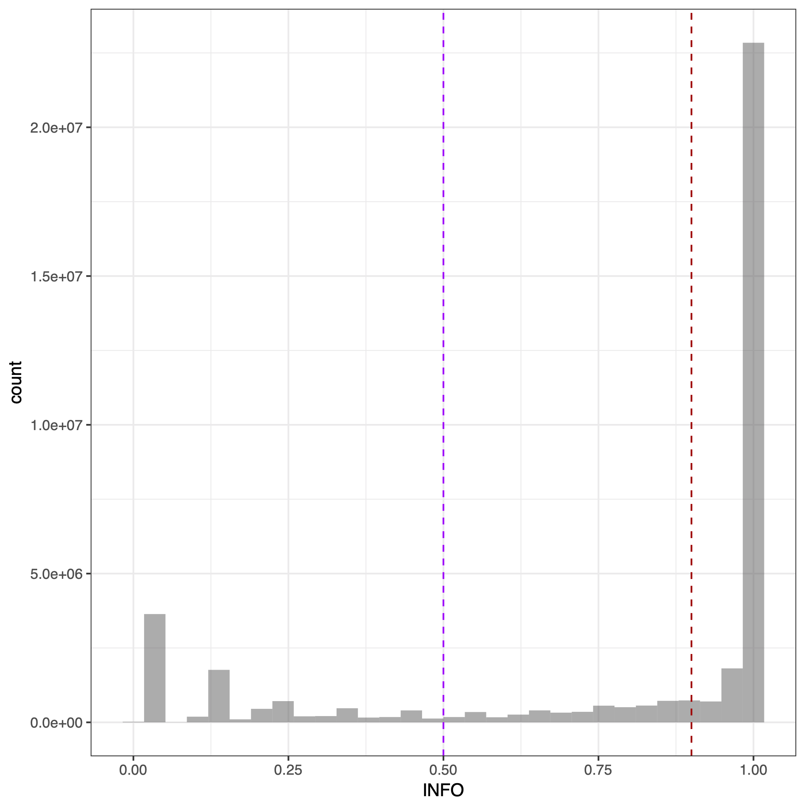
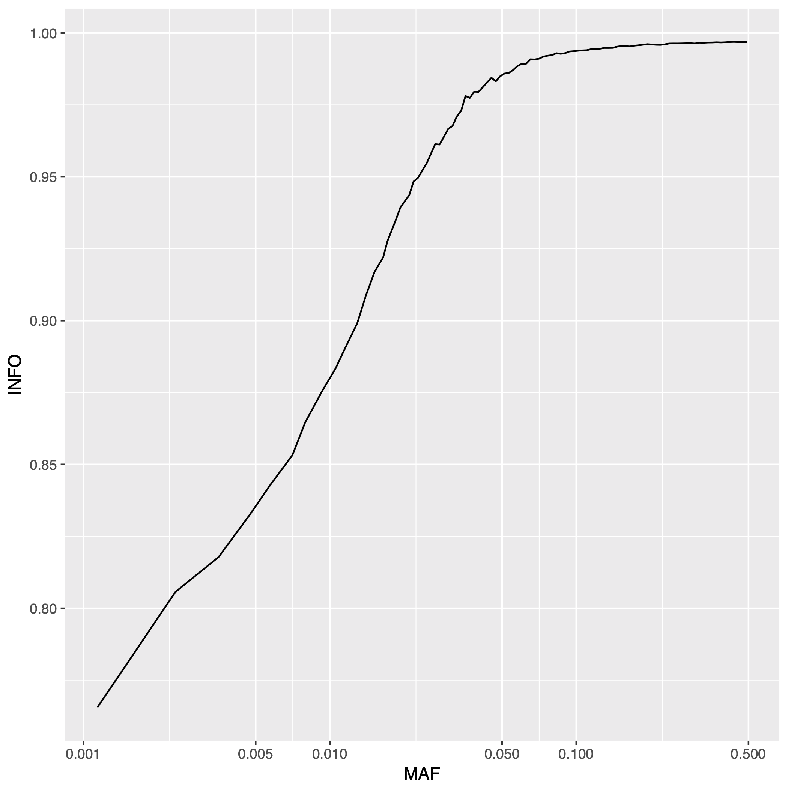
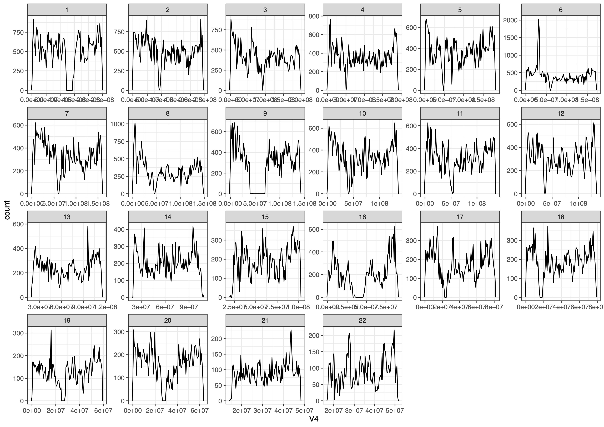
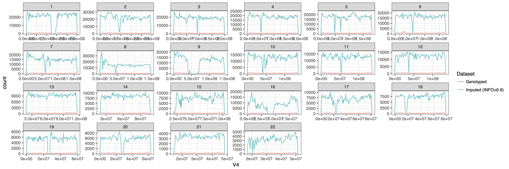

# Imputation through the HRC for Fairfax genotyping data

This document describes submitting data for imputation through the Sanger Imputation Service, a free imputation server 
which can found [here](https://imputation.sanger.ac.uk/). Genotyping data was uploaded onto the server and the Haplotype Reference Consortium reference panel was used for imputation of the uploaded data. The code detailed in this document is adapted from Katie Burnham.

Genotyping data from:
1. Fairfax BP *et al.* Innate immune activity conditions the effect of regulatory variants upon monocyte gene expression. Science 2014 343:1246949.

---

The Fairfax genotyping data is saved in PLINK binary (bed/bim) format, under:
/well/jknight/shiyao/data/extreme_response

First, the PLINK file was checked against the HRC reference panel for strand, alleles, position, Ref/Alt assignments, and frequency differences using a script written by Will Rayner (McCarthy), which is available from [www.well.ox.ac.uk/~wrayner/tools/index.html#Checking]. This script requires the HRC reference file (download from same site), the .bim, and .frq files. The .frq file is generated using the following comands:

```bash
cd /well/jknight/shiyao/data/extreme_response
/apps/well/plink/1.90b3/plink --bfile extreme_response --noweb --freq --out imputation/hrc_check/extreme_response
```

The script below was then submitted to the cluster to check the PLINK file against the HRC reference panel, and is saved under: /well/jknight/shiyao/data/extreme_response/imputation/hrc_check/hrc_check_all.sh

```bash
#!/bin/bash

#$ -cwd -V
#$ -N hrc_check
#$ -P jknight.prjc
#$ -q short.qc
#$ -o /well/jknight/shiyao/data/extreme_response/imputation/hrc_check/hrc_check_stdout.log 
#$ -e /well/jknight/shiyao/data/extreme_response/imputation/hrc_check/hrc_check_stderr.log
#$ -pe shmem 2

echo "************************"
echo "Job ID: "$JOB_ID
echo "Task ID: "$SGE_TASK_ID
echo "Run on host: "`hostname`
echo "Operating system: "`uname -s`
echo "Username: "`whoami`
echo "Started at: "`date`
echo "************************"

perl /well/jknight/shiyao/data/extreme_response/imputation/hrc_check/HRC-1000G-check-bim.pl \
-b /well/jknight/shiyao/data/extreme_response/extreme_response.bim \
-f /well/jknight/shiyao/data/extreme_response/imputation/hrc_check/extreme_response.frq \
-r /well/jknight/shiyao/data/extreme_response/imputation/hrc_check/HRC.r1-1.GRCh37.wgs.mac5.sites.tab \
-h

echo "************************"
echo "Finished at: "`date`
echo "************************"
```

---

Next, the SNPs identified was updated or removed using the script below, which is saved under: /well/jknight/shiyao/data/extreme_response/imputation/Run-plink/Run-plink-edited.sh  
This script was edited from the Run-plink.sh script generated by Will's script to export one VCF file and recode the chromosomes in accordance with the Sanger Imputation Service requirements.

```bash
#!/bin/bash

#$ -cwd -V
#$ -N hrc_imp
#$ -P jknight.prjc
#$ -q short.qc
#$ -o /well/jknight/shiyao/data/extreme_response/imputation/Run-plink/hrc_imp_stdout.log
#$ -e /well/jknight/shiyao/data/extreme_response/imputation/Run-plink/hrc_imp_stderr.log
#$ -pe shmem 1

echo "Username: "`whoami`
echo "Started at: "`date`
echo "************************"

/apps/well/plink/1.90b3/plink --bfile extreme_response --exclude Exclude-extreme_response-HRC.txt --make-bed --out TEMP1
/apps/well/plink/1.90b3/plink --bfile TEMP1 --update-map Chromosome-extreme_response-HRC.txt --update-chr --make-bed --out TEMP2
/apps/well/plink/1.90b3/plink --bfile TEMP2 --update-map Position-extreme_response-HRC.txt --make-bed --out TEMP3
/apps/well/plink/1.90b3/plink --bfile TEMP3 --flip Strand-Flip-extreme_response-HRC.txt --make-bed --out TEMP4
/apps/well/plink/1.90b3/plink --bfile TEMP4 --reference-allele Force-Allele1-extreme_response-HRC.txt --make-bed --out extreme_response-updated
/apps/well/plink/1.90b3/plink --bfile extreme_response-updated --recode vcf-iid --a2-allele Force-Allele1-extreme_response-HRC.txt --real-ref-alleles --out fairfax_432samples-updated --output-chr M
rm TEMP*

echo "************************"
echo "Finished at: "`date`
echo "************************"
```

The VCF file was then uploaded to the [Sanger Imputation Service](https://imputation.sanger.ac.uk/). The reference panel chosen was Haplotype Reference Consortium (r1.1) and the pipeline chosen was pre-phase with EAGLE2 and impute.

---

After imputation, the files downloaded consist of a single bgzipped vcf file per chromosome. The info score (confidence) and  MAF was first exported using the following script, which is saved under: /well/jknight/shiyao/data/extreme_response/imputation/info_freq/info_freq.sh

```bash
#!/bin/bash

#$ -cwd -V
#$ -N info_freq
#$ -P jknight.prjc
#$ -q short.qc
#$ -o /well/jknight/shiyao/data/extreme_response/imputation/info_freq/info_freq_stdout.log
#$ -e /well/jknight/shiyao/data/extreme_response/imputation/info_freq/info_freq_stderr.log
#$ -pe shmem 1

echo "************************"
echo "Job ID: "$JOB_ID
echo "Task ID: "$SGE_TASK_ID
echo "Run on host: "`hostname`
echo "Operating system: "`uname -s`
echo "Username: "`whoami`
echo "Started at: "`date`
echo "************************"

for P in {1..22} ; do /apps/well/vcftools/16102015/bin/vcftools --gzvcf /well/jknight/shiyao/data/extreme_response/imputation/fairfax432.vcfs/${P}.vcf.gz --get-INFO INFO --out chr${P} ; done

for P in {1..22} ; do /apps/well/vcftools/16102015/bin/vcftools --gzvcf /well/jknight/shiyao/data/extreme_response/imputation/fairfax432.vcfs/${P}.vcf.gz --freq --out chr${P} ; done

echo "************************"
echo "Finished at: "`date`
echo "************************"
```

The range of info score was plotted using the following R script:

```r
library(data.table)
library(ggplot2)

# Load MAF data
freq.files <- list.files(path="/well/jknight/shiyao/data/extreme_response/imputation/", 
                         pattern="*.frq")
freq.files <- paste("/well/jknight/shiyao/data/extreme_response/imputation/",
                    freq.files, sep="")
freq.files <- freq.files[-c(23)]

freqs <- list()
for (i in 1:22){
  freqs[[i]] <- read.delim(freq.files[[i]], header=FALSE, stringsAsFactors=F)
  colnames(freqs[[i]]) <- freqs[[i]][1, ]
  freqs[[i]] <- freqs[[i]][-1, ]
}

freqs <- rbindlist(freqs)

freqs$MAF <- freqs[, 6]
freqs$MAF <- gsub('[^0-9.]', '', freqs$MAF)
freqs$MAF <- as.numeric(freqs$MAF)
freqs$MAF[freqs$MAF > 0.5] <- 1 - freqs$MAF[freqs$MAF > 0.5]

# Load info score data
info.files <- list.files(path="/well/jknight/shiyao/data/extreme_response/imputation/info_freq/",
                         pattern="*.INFO")
info.files <- paste("/well/jknight/shiyao/data/extreme_response/imputation/info_freq/",
                    info.files, sep="")
info <- list()
for (i in 1:22){
  info[[i]] <- read.delim(info.files[[i]], header=FALSE, stringsAsFactors=F)
  colnames(info[[i]]) <- info[[i]][1, ]
  info[[i]] <- info[[i]][-1, ]
}

info1 <- rbindlist(info)
info1$INFO <- as.numeric(info1$INFO)
info1$MAF <- freqs$MAF

# Histogram showing range of info scores after imputation
pdf("/well/jknight/shiyao/data/extreme_response/imputation/Imputation_infoscore.pdf", onefile = TRUE, useDingbats = FALSE)
ggplot(info1, aes(INFO)) +
  geom_histogram(alpha=0.5, position="dodge") +
  geom_vline(xintercept=0.9, colour="#BB0000", linetype="dashed") +
  geom_vline(xintercept=0.5, colour="#BB00ff", linetype="dashed") +
  theme_bw()
dev.off()

# Calculate median info score for different MAFs
pdf("/well/jknight/shiyao/data/extreme_response/imputation/Imputation_infoscore_MAF.pdf", onefile = TRUE, useDingbats = FALSE)
ggplot(info1, aes(MAF, INFO)) +
  scale_x_continuous(trans="log10", 
                     breaks=c(0, 0.001, 0.005, 0.01, 0.05, 0.1, 0.5)) +
  stat_summary_bin(fun.y=median, geom="line", bins=150)
dev.off()
```
The plots generated are shown below:

*Imputation info score*

*Imputation median info score for MAFs*

---

The script below (saved under: /well/jknight/shiyao/data/extreme_response/imputation/info_0.9/imp_filter/imp_filter.sh) was submited to the cluster to keep only calls with an info score > 0.9 and convert to Oxford format:

```bash
#!/bin/bash

#$ -cwd -V
#$ -N imp_filter_432
#$ -P jknight.prjc
#$ -q short.qc
#$ -o /well/jknight/shiyao/data/extreme_response/imputation/info_0.9/imp_filter_432_stdout.log
#$ -e -e /well/jknight/shiyao/data/extreme_response/imputation/info_0.9/imp_filter_432_stderr.log
#$ -pe shmem 1

echo "************************"
echo "Job ID: "$JOB_ID
echo "Task ID: "$SGE_TASK_ID
echo "Run on host: "`hostname`
echo "Operating system: "`uname -s`
echo "Username: "`whoami`
echo "Started at: "`date`
echo "************************"

for P in {1..22} ; do /apps/well/bcftools/1.3/bin/bcftools view -Ou -i 'INFO>0.9' /well/jknight/shiyao/data/extreme_response/imputation/fairfax432.vcfs/${P}.vcf.gz | /apps/well/bcftools/1.3/bin/bcftools convert --tag GP -g ${P}.imputed.filtered ; done

echo "************************"
echo "Finished at: "`date`
echo "************************"
```
 
 The data was then combined by chromosome and written as bed files using the following commands:
 
 ```bash
 for P in {1..22} ; do /apps/well/plink/1.90b3/plink --gen ${P}.imputed.filtered.gen.gz \
--sample ${P}.imputed.filtered.samples --oxford-single-chr ${P} \
--out ${P}.imputed.filtered --make-bed ; done
```

---

The bed files were then read into Plink and filtered by MAF, call rate, and HWE before being written to a new bed file.

```bash
for P in {1..22} ; do /apps/well/plink/1.90b3/plink --bfile ${P}.imputed.filtered --geno 0.05 --hwe 0.001 --maf 0.05 --make-bed --out ${P}.imputed.filtered.eqtl ; done

for P in {1..22} ; do /apps/well/plink/1.90b3/plink --bfile ${P}.imputed.filtered.eqtl --recode A --out chr.${P}.genotyping.raw; done
```

The data from all chromosomes was combined into a single bed file.

```bash
/apps/well/plink/1.90b3/plink --bfile 1.imputed.filtered.eqtl --make-bed --merge-list ../files-to-merge.txt --out genotyping_for_eqtl
```

---

Finally, PCs were computed and variants in high LD regions identified by Anderson *et al.* (2010) in the "high-LD-regions.txt" file were filtered out.

```bash
/apps/well/plink/1.90b3/plink --bfile genotyping_for_eqtl --indep-pairwise 50 5 0.2 --out fairfax_eqtl_genotyping_noLD

/apps/well/plink/1.90b3/plink --bfile genotyping_for_eqtl --exclude ../high_LD_regions_hg19.txt --range --make-bed --out fairfax_eqtl_genotyping_NoLongRangeLD

/apps/well/plink/1.90b3/plink --bfile fairfax_eqtl_genotyping_NoLongRangeLD --extract fairfax_eqtl_genotyping_noLD.prune.in --pca --out eqtl_genotyping_pca
```

---

Imputation plots were created in R:

```r
library(data.table)
library(ggplot2)

# Genotyping coverage
extr_resp.bim <- read.delim("/well/jknight/shiyao/data/extreme_response/extreme_response.bim", header=FALSE)
extr_resp.bim <- extr_resp.bim[extr_resp.bim$V1 %in% 1:22, ]
extr_resp.bim$V1 <- as.factor(extr_resp.bim$V1)

pdf("/well/jknight/shiyao/data/extreme_response/imputation/Genotyping_coverage.pdf", onefile = TRUE, useDingbats = FALSE)
ggplot(extr_resp.bim, aes(V4)) +
  geom_freqpoly(bins=100) +
  facet_wrap(~ V1, nrow=4, ncol=6, scales="free") +
  theme_bw()
dev.off()

# Genotyping coverage by chromosome
n.genotyped <- matrix(NA, nrow=22, ncol=1)
for(c in 1:22){
  extr_resp.data <- subset(extr_resp.bim, V1 == c)
  n.genotyped[c, 1] <- nrow(extr_resp.data)
}

n.genotyped <- data.frame(cbind("Chromosome" = 1:22, n.genotyped))
colnames(n.genotyped) <- c("Chromosome", "Genotyping")
df.melt <- melt(n.genotyped, id="Chromosome")
df.melt$Chromosome <- as.factor(df.melt$Chromosome)

pdf("/well/jknight/shiyao/data/extreme_response/imputation/Genotyping_coverage2.pdf", onefile = TRUE, useDingbats = FALSE)
ggplot(df.melt, aes(Chromosome, value, fill=variable)) +
  geom_bar(stat="identity", position="dodge", alpha=0.5) +
  theme_bw()
dev.off()

# Get number of variants at each stage
n.imputed <- matrix(NA, nrow=22, ncol=1)
for(c in 1:22){
  imputed.data <- read.delim(paste("/well/jknight/shiyao/data/extreme_response/imputation/info_freq/chr", c, ".INFO", sep=""), header=TRUE, stringsAsFactors=F)
  n.imputed[c, 1] <- nrow(imputed.data)
}

n.infofilter_0.9 <- matrix(NA, nrow=22, ncol=1)
for (c in 1:22){
  infofilter_0.9.bim <- read.delim(paste("/well/jknight/shiyao/data/extreme_response/imputation/info_0.9/imp_filter/", c, ".imputed.filtered.bim", sep=""), header=FALSE)
  n.infofilter_0.9[c, 1] <- nrow(infofilter_0.9.bim)
}

n.filtered_0.9 <- matrix(NA, nrow=22, ncol=1)
filtered_0.9.bim <- read.delim("/well/jknight/shiyao/data/extreme_response/imputation/info_0.9/genotyping_for_eqtl.bim", header=FALSE)
for (c in 1:22){
  filtered_0.9.data <- subset(filtered_0.9.bim, V1 == c)
  n.filtered_0.9[c, 1] <- nrow(filtered_0.9.data)
}

n.noLD_0.9 <- matrix(NA, nrow=22, ncol=1)
noLD_0.9.bim <- read.delim("/well/jknight/shiyao/data/extreme_response/imputation/info_0.9/fairfax_eqtl_genotyping_NoLongRangeLD.bim", header=FALSE)
for (c in 1:22){
  noLD_0.9.data <- subset(noLD_0.9.bim, V1 == c)
  n.noLD_0.9[c, 1] <- nrow(noLD_0.9.data)
}

combined <- data.frame(cbind("Chromosome" = 1:22, n.genotyped, n.imputed, n.infofilter_0.9, n.filtered_0.9, n.noLD_0.9))
colnames(combined) <- c("Chromosome", "Genotyped", "Imputed", "Info>0.9", "Filtered", "NoLD")
df.melt <- melt(combined, id=c("Chromosome"))
df.melt$variable <- factor(df.melt$variable)

# Plot number of variants at each stage
pdf("/well/jknight/shiyao/data/extreme_response/imputation/Imputation_overview.pdf", height=5, width=8)
ggplot(df.melt, aes(Chromosome, value, fill=variable)) +
  geom_col(position="stack") +
  scale_fill_brewer(palette="Spectral") +
  theme_bw() +
  ggtitle("Overview of Imputation Filtering")
dev.off()

# Imputation coverage
bim.files <- list.files(path="/well/jknight/shiyao/data/extreme_response/imputation/info_0.9/imp_filter/",
                        pattern="*.imputed.filtered.bim")
bim.files <- paste("/well/jknight/shiyao/data/extreme_response/imputation/info_0.9/imp_filter/",
                    bim.files, sep="")
bims <- list()
for (i in 1:22){
  bims[[i]] <- read.delim(bim.files[[i]], header=FALSE)
}
bims <- rbindlist(bims)

# Imputation vs genotyping coverage
extr_resp.bim <- extr_resp.bim[, c("V1", "V4")]
extr_resp.bim$Dataset="Genotyped"
bims <- bims[, c("V1", "V4")]
bims$Dataset="Imputed (INFO>0.9)"
extr_resp.bim <- rbind(extr_resp.bim, bims)

pdf("/well/jknight/shiyao/data/extreme_response/imputation/GenotypingvsImputationCoverage.pdf", height=5, width=15)
ggplot(extr_resp.bim, aes(V4, colour=Dataset)) +
  geom_freqpoly(bins=100) +
  facet_wrap(~ V1, nrow=4, ncol=6, scales="free") +
  theme_bw()
dev.off()
```

The plots generated are shown below:

*Genotyping coverage*

*Genotyping coverage by chromosome*

*Overview of imputation filtering*

*Genotyping vs imputation coverage*

